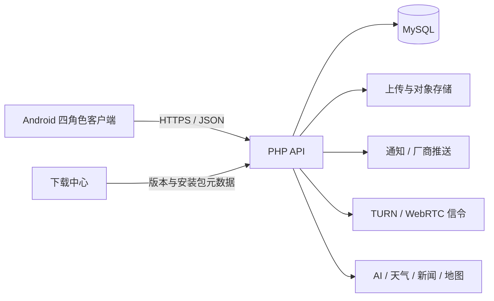

# 架构说明

## 总体结构

## Android

- 单一应用模块，通过 product flavor 生成 `platformOwner`、`authorizedPlatform`、`admin`、`user` 四端。
- 共享 API、缓存、媒体和设计系统，角色差异由 flavor 配置与后端权限共同控制。
- `version.properties` 是 Android 版本的唯一源码入口；下载中心元数据在发布时必须同步。
- 聊天列表、消息详情、媒体缓存与基础资料支持离线只读；网络恢复后再增量同步。
- 通话采用 WebRTC。信令、ICE 状态、通话生命周期和通知状态必须以会话 ID 幂等处理。

## 后端

- PHP 8.1+，轻量路由与控制器结构，PDO MySQL 数据访问。
- `config/app.php` 只读取环境变量并提供安全的本地默认值。
- 权限模型按平台、应用、角色和资源作用域组合，所有写操作必须后端鉴权。
- 媒体上传按 MIME、扩展名、大小、内容摘要与权限验证；下载通过受控接口返回，不能向剪贴板泄露服务器真实路径。
- 通知分为聊天会话通知、动态互动通知、系统/维护/更新通知，避免把点赞等互动混入聊天列表。

## 下载中心

- React 19 + Next/Vinext，可构建为服务端或静态站点。
- `release-metadata.json` 描述当前发行版本；发布脚本必须校验 APK 内版本、Android 源码版本和接口版本一致。

## 数据一致性

- 消息、通知、订单、资金、红包、转账和审核记录使用稳定 ID 与状态机。
- 收藏保存来源类型、来源 ID、快照和跳转定位，支持“查看快照”与“回到来源”两条路径。
- 转发聊天记录保存只读快照；嵌套转发保持原始快照边界，匿名仅作用于用户选择的层级。
- 红包与转账由服务端事务结算，24 小时过期自动退回未领取余额，状态更新必须幂等。

## 性能原则

- 首屏只加载摘要；图片、视频、相册、文件和动态采用分页、缩略图和增量渲染。
- 列表刷新保留滚动锚点，用户向上阅读时不强制跳到底部。
- 媒体使用内容摘要去重，缓存采用容量和时间双重淘汰。
- 生产环境开启 PHP OPcache、HTTP/2/3、静态资源长缓存和数据库慢查询监控。
